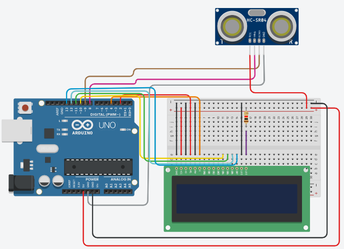

# Projeto 03 - 

> Projeto cem desenvolvimento 

## 🛠️ Sobre

## 🛠️ Diagrama



## :open_file_folder: Hardware necessários

|:---|:---:|
|Qnt. |componente|
|1| Arduino Uno |
|1| Sensor de distância ultrassônico
|1| LCD 16x2|
|1| Resistor |
|4| cabos jumper macho-femea |
|14| cabos jumper macho-macho |

## 💭 Como programar

> No Arduino é ultilizado a linguagem c++ para programar 👩‍💻

## Exemplo de código

``` #include <LiquidCrystal.h>

int trigPin = 8;    
int echoPin = 9;    

float duracao_us, distancia_cm;

LiquidCrystal lcd(2,4,10,11,12,13); 
void setup() {
   Serial.begin (9600);
  pinMode(trigPin, OUTPUT);
  pinMode(echoPin, INPUT);
  lcd.begin(16,2); 
   
}
void loop() {
  digitalWrite(trigPin, HIGH);
  delayMicroseconds(10);
  digitalWrite(trigPin, LOW);
  duracao_us = pulseIn(echoPin, HIGH);
  distancia_cm = 0.017 * duracao_us;
  lcd.clear();
  lcd.setCursor(1,2);
  lcd.print("distancia:" );
  lcd.print(distancia_cm);
  lcd.print(" cm");

  delay(1000);

} 
```

## Passo rápido

- copie e cole o código acima no Arduino IDE
- Clique no botão 'Carregar'
- E veja o resultado no LCD
