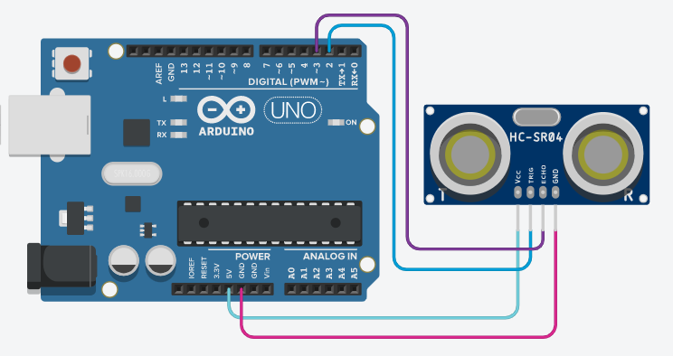

# Projeto 02 - Ultrassonico
> Projeto concluído 🥳

A principal função do ultrassonico é a mesmo ultilizada por morcegos para se localizarem.Basicamente ele emite uma onda Ultrassônica e aguarda que essa onda atinja algum objeto e retorne para identificar obstaculos em seu trajeto 

## 📑 Sobre o Ultrassônico


O sensor ultrassônico HC-SR04 é usado para medir a distância de um determinado objeto ultilizando ondas ultrassônicas
. O ultrassônico possui quatro pinos

<br>

## 🛠️ Diagrama 



## :open_file_folder: Hardware necessários
Os itens listados abaixo foram ultilizados para a contrução do nosso Ultrassônico, outros projetos podem requerer mais ou menos itens.
|Qnt.|Componente|
|:---:|:---|
|1|Arduino UNO|
|1|Ultrassônico|
|4|Cabos jumper macho-femea|

## 💭 Como programar o ultrassônico
> No Arduino é ultilizado a linguagem c++ para programar 👩‍💻

Faça um pulso de 10 microsegundos no pino usando as funções `digitalWrite()` e `delayMicroseconds()`.
```
digitalWrite(9, HIGH); 
delayMicroseconds(10); 
digitalWrite(9, LOW);
```
meça a duração do pulso ultlzando a função `pulseIn().`
```
duracao_us = pulseIn(8, HIGH);
```

Para calcular a distancia em cm basta digitar:

```
distancia_cm = 0,017 * duration_us;
```

## Exemplo de código:

```
int trigPin = 2;    
int echoPin = 3;    

float duracao_us, distancia_cm;

void setup() {
  Serial.begin (9600);

  pinMode(trigPin, OUTPUT);
  pinMode(echoPin, INPUT);
}

void loop() {
  digitalWrite(trigPin, HIGH);
  delayMicroseconds(10);
  digitalWrite(trigPin, LOW);

  duracao_us = pulseIn(echoPin, HIGH);
  distancia_cm = 0.017 * duracao_us;
  Serial.print("distancia: ");
  Serial.print(distancia_cm);
  Serial.println(" cm");

  delay(500);
}
```

## Passo rápido

- copie e cole o código acima no Arduino IDE
- Clique no botão 'Carregar' 
- E veja o resultado no monitor serial
